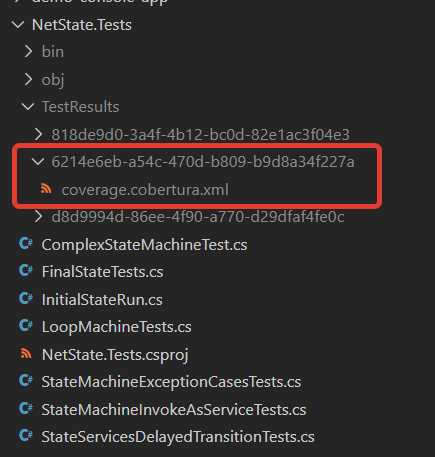
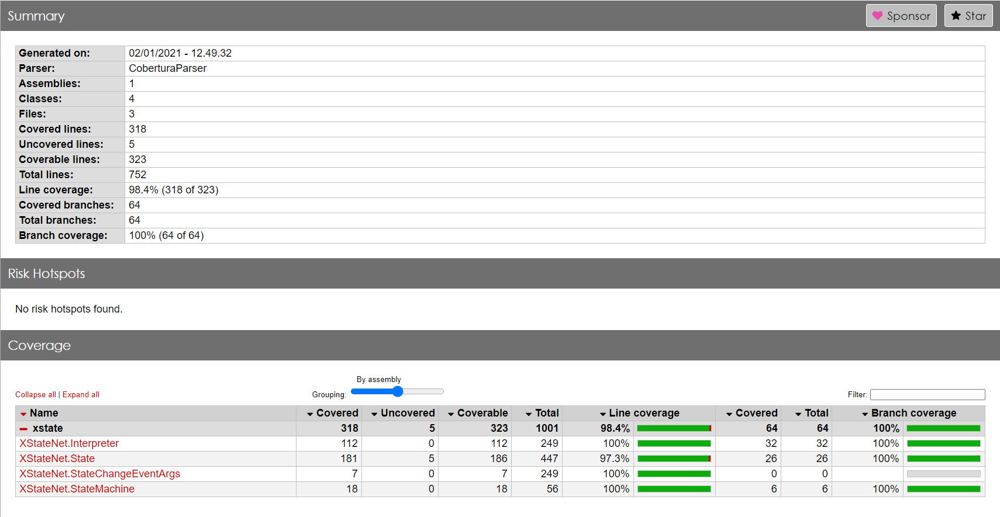

# Important

Work in progress! I will notify here once the version of the state machine engine can be used in production.

# xstate.net

.NET implementation of the finite state machine framework.

# Main classes

- StateMachine
    - ~~has list of states~~;
    - ~~has initial state~~;
- State
    - ~~Can Invoke Service(s) or another StateMachine~~;
    - ~~Has OnEntry actions~~;
    - ~~Has OnExit actions~~;
    - ~~Can be a final state;~~
    - ~~Can be a transient state~~;
    - ~~Can have a delayed (timeout) transition~~;
- Service
    - ~~Executes while machine in the state, can change state via callback("name");~~
    - ~~has OnDone transition in case of service is async;~~
    - ~~has OnError transition in case of service is async~~
- Action
    - ~~Fire and forget Action~~
- Activity
- StateMachineInterpreter
    - ~~Can run state machine;~~
    - ~~Has event on state changed;~~
    - ~~Throws error in any case~~;


# Generate test coverage HTML

Open terminal in the project root directory. First, collect XPlat Code Coverage into XML file.

> To collect code coverage on any platform that is supported by .NET Core, install [Coverlet](https://github.com/coverlet-coverage/coverlet/blob/master/README.md) and use the --collect:"XPlat Code Coverage" option.

```sh
dotnet test --collect:"XPlat Code Coverage"
```

This will generate the XML file with cobertura format under `NetState.Tests` -> `TestResults` -> `<guid>` -> `coverage.cobertura.xml` file.



Second, if you don't have `reportgenerator` tool for dotnet, install it globally.

```sh
dotnet tool install -g dotnet-reportgenerator-globaltool
```

Then you can generate HTML files to browse the code coverage:

```sh
reportgenerator "-reports:NetState.Tests\TestResults\<guid>\coverage.cobertura.xml" "-targetdir:__HtmlCodeCoverageReport" -reporttypes:Html
```

> Note! replace `<guid>` with the GUID that was generated by the test coverage XML generator.

This will create the HTML report, which you can browse in your internet explorer.


Open `index.htm` or `index.html` in your browser.


